# 🔄 SonarQube to Jira Integration System

## 🎯 What Does This System Do?

This automated system connects **SonarQube** (a code quality scanner) with **Jira** (a project management tool) to streamline software development workflows. Think of it as a smart bridge that automatically manages tasks between these two systems.

### 🌟 Key Benefits
- **Saves Time**: No manual ticket creation or tracking
- **Prevents Issues**: Automatically catches code problems and creates tasks to fix them
- **Maintains Quality**: Ensures code issues don't get forgotten
- **Reduces Manual Work**: Automatically closes tickets when problems are solved

---

## 📊 System Flow Diagram

```mermaid
flowchart TD
    %% Ticket Creation Flow
    A1[⏰ Daily Schedule Trigger<br>7:00 AM IST] --> B1{📋 Get Active Projects}
    P[👤 Manual API Call] --> B1
    B1 --> C1[🔍 Scan SonarQube for Issues]
    C1 --> D1[📝 Found New Issues/Hotspots?]
    D1 -->|Yes| E1[🎫 Create Jira Tickets]
    D1 -->|No| F1[✅ No Action Needed]
    E1 --> G1[📧 Assign to Team Members]
    G1 --> H1[🔗 Link Back to SonarQube]
    
    %% Ticket Closure Flow
    A2[⏰ Bi-Monthly Schedule Trigger<br>1st & 15th of Month] --> B2[🔍 Find Open SonarQube Tickets]
    Q[👤 Manual Close Request] --> B2
    B2 --> C2[🧹 Check: Are Issues Still Active?]
    C2 -->|Issue Resolved| D2[✅ Close Jira Ticket]
    C2 -->|In Code Review or<br>Code Review Pass| F2[🔍 Skip Auto-Close]
    D2 --> G2[💬 Add Closure Comment]
    
    %% Styling with high contrast colors for better visibility
    style A1 fill:#b3e5fc,stroke:#0277bd,stroke-width:2px,color:#01579b
    style A2 fill:#ffccbc,stroke:#bf360c,stroke-width:2px,color:#bf360c
    style P fill:#d1c4e9,stroke:#4527a0,stroke-width:2px,color:#4527a0
    style Q fill:#d1c4e9,stroke:#4527a0,stroke-width:2px,color:#4527a0
    style B1 fill:#bbdefb,stroke:#1565c0,stroke-width:2px,color:#0d47a1
    style B2 fill:#ffccbc,stroke:#e64a19,stroke-width:2px,color:#bf360c
    style C1 fill:#b3e5fc,stroke:#0277bd,stroke-width:2px,color:#01579b
    style C2 fill:#ffccbc,stroke:#e64a19,stroke-width:2px,color:#bf360c
    style E1 fill:#c8e6c9,stroke:#2e7d32,stroke-width:2px,color:#1b5e20
    style D2 fill:#ef9a9a,stroke:#c62828,stroke-width:2px,color:#b71c1c
    style F1 fill:#e1bee7,stroke:#6a1b9a,stroke-width:2px,color:#4a148c
    style E2 fill:#ffe0b2,stroke:#ef6c00,stroke-width:2px,color:#e65100
    style F2 fill:#fff9c4,stroke:#f57f17,stroke-width:2px,color:#f57f17
```



---

## 🔧 How It Works (Simple Explanation)

### 🎫 **Part 1: Creating Tickets**
1. **Daily Execution**: Runs automatically every day at 7:00 AM IST
2. **Project Discovery**: The system looks at your configured projects
3. **Issue Scanning**: It checks SonarQube for new code problems (bugs, security issues, code smells)
4. **Smart Filtering**: Only creates tickets for NEW issues (avoids duplicates)
5. **Ticket Creation**: Creates detailed Jira tickets with:
   - Clear problem description
   - File location where the issue exists
   - Priority level (High/Highest based on severity)
   - Direct link back to SonarQube
6. **Team Assignment**: Assigns tickets to the right team members automatically

### 🧹 **Part 2: Closing Tickets**
1. **Scheduled Check**: Every 1st and 15th of the month, the system reviews all open SonarQube-related tickets
2. **Status Verification**: For each ticket, it checks if the original issue still exists in SonarQube
3. **Smart Closure**: If the issue is resolved (code fixed), it automatically closes the ticket
4. **Special Handling**: Tickets in "Code Review" or "Code Review Pass" status are excluded from auto-closure (team decides when to close)
5. **Documentation**: Adds a comment explaining why the ticket was closed

---

## 🛠️ Technical Features

### 🎫 **Ticket Creation Process**
- **Automatic Detection**: Finds new SonarQube issues and security hotspots
- **Daily Execution**: Runs automatically every day at 7:00 AM IST
- **Duplicate Prevention**: Checks existing tickets before creating new ones
- **Smart Prioritization**: 
  - `BLOCKER`/`CRITICAL` issues → **Highest Priority**
  - Other issues → **High Priority**
  - High/Medium security risks → **Highest Priority**
- **Rich Content**: Includes project info, file details, and direct SonarQube links
- **Batch Processing**: Handles large numbers of projects efficiently

### 🔄 **Ticket Closure Process**
- **Intelligent Detection**: Identifies resolved issues by checking SonarQube API
- **Bi-Monthly Execution**: Runs on 1st and 15th of each month
- **Pagination Support**: Handles unlimited number of tickets (not limited by API defaults)
- **Status Awareness**: Excludes tickets in "Code Review" and "Code Review Pass" from auto-closure
- **Comprehensive Logging**: Detailed tracking for troubleshooting
- **Error Resilience**: Continues processing even if individual tickets fail

---

## 🌐 API Endpoints

| Endpoint | Method | Purpose | Who Uses It | Schedule |
|----------|---------|---------|-------------|-----------|
| `/sonar-to-jira` | POST | Create tickets for new issues | SonarQube webhooks, Manual triggers | Daily at 7:00 AM IST |
| `/close-resolved-tickets` | POST | Close tickets for resolved issues | Bi-monthly scheduler, Manual triggers | 1st & 15th of each month |

---

## 🔧 System Architecture

### 📦 **Components**
- **Main Handler** (`src/index.js`): Orchestrates the ticket creation process
- **Project Fetcher** (`src/functions/project_fetcher.js`): Discovers active projects
- **Ticket Closer** (`src/functions/ticket_closer.js`): Handles automatic ticket closure
- **Core Service** (`src/service/sonar_to_jira_service.js`): Business logic for both processes

### 🔐 **Security & Configuration**
- Environment-based configuration (no hardcoded secrets)
- Rate limiting to prevent API overload
- Retry mechanisms for network resilience
- Comprehensive error handling and logging

---

## ⚙️ Environment Configuration

This system supports two deployment modes with automatic environment detection:

### 🏠 **Local Development Mode**

For local development and testing, the system reads configuration from a `.env` file:

1. **Setup Local Environment:**
   ```bash
   # Copy the example environment file
   cp .env.example .env
   
   # Edit .env with your actual credentials
   nano .env
   ```

2. **Required Environment Variables:**
   ```bash
   # SonarQube Configuration
   SONARQUBE_BASE_URL=https://your-sonarqube-instance.com
   SONARQUBE_TOKEN=your_sonarqube_token_here
   SONARQUBE_PROJECT_KEY=your_fallback_project_key
   
   # Jira Configuration
   JIRA_BASE_URL=https://your-company.atlassian.net
   JIRA_USERNAME=your-jira-email@company.com
   JIRA_API_TOKEN=your_jira_api_token_here
   ```

3. **How Local Detection Works:**
   - System checks for `AWS_LAMBDA_FUNCTION_NAME` environment variable
   - If not found, automatically uses local `.env` file
   - Uses `dotenv` package to load environment variables

### ☁️ **AWS Production Mode**

For AWS Lambda deployment, the system automatically fetches configuration from AWS Secrets Manager:

1. **AWS Secrets Manager Setup:**
   - Secret Name: `Los-ShardRes-Jira-Scrt` (configurable via template parameter)
   - Secret Type: JSON key-value pairs

2. **Secret Structure in AWS Secrets Manager:**
   ```json
   {
     "SONARQUBE_BASE_URL": "https://your-sonarqube-instance.com",
     "SONARQUBE_TOKEN": "your_sonarqube_token_here",
     "SONARQUBE_PROJECT_KEY": "your_fallback_project_key",
     "JIRA_BASE_URL": "https://your-company.atlassian.net",
     "JIRA_USERNAME": "your-jira-email@company.com",
     "JIRA_API_TOKEN": "your_jira_api_token_here"
   }
   ```

3. **How AWS Detection Works:**
   - System checks for `AWS_LAMBDA_FUNCTION_NAME` or `AWS_EXECUTION_ENV`
   - If found, fetches configuration from AWS Secrets Manager
   - Uses the secret name from `SonarJiraSecretName` environment variable

### 🔄 **Automatic Environment Detection**

The system automatically determines the environment:

```javascript
// Environment detection logic
function isAWSEnvironment() {
    return !!(process.env.AWS_LAMBDA_FUNCTION_NAME || process.env.AWS_EXECUTION_ENV);
}

// Configuration loading
async function getEnvironmentVariables() {
    if (isAWSEnvironment()) {
        // Load from AWS Secrets Manager
        return await getSecretsFromAWS(process.env.SonarJiraSecretName);
    } else {
        // Load from local .env file
        return getSecretsFromLocal();
    }
}
```

### 📋 **Configuration Validation**

The system validates all required environment variables on startup:

- ✅ **Required Variables**: `SONARQUBE_BASE_URL`, `SONARQUBE_TOKEN`, `JIRA_BASE_URL`, `JIRA_USERNAME`, `JIRA_API_TOKEN`
- ⚠️ **Optional Variables**: `SONARQUBE_PROJECT_KEY` (fallback for single-project setups)
- 🚫 **Security**: All variables are validated but never logged for security

### 🔒 **Security Best Practices**

1. **Local Development:**
   - Never commit `.env` files to version control
   - Use `.env.example` for documentation
   - Rotate tokens regularly

2. **AWS Production:**
   - Store all secrets in AWS Secrets Manager
   - Use IAM roles with minimum required permissions
   - Enable CloudTrail for audit logging
   - Rotate secrets using AWS Secrets Manager automation

---

## 🚀 Deployment & Scheduling

### ⚡ **AWS Lambda Functions**
- **Serverless Architecture**: Runs only when needed (cost-effective)
- **Auto-scaling**: Handles varying workloads automatically
- **Event-driven**: Responds to webhooks and scheduled events

### ⏰ **Automated Scheduling**
- **Daily Ticket Creation**: Runs every day at 7:00 AM IST (1:30 AM UTC) to create tickets for new issues
- **Bi-Monthly Ticket Cleanup**: Runs on 1st and 15th of each month to close resolved tickets
- **Webhook Integration**: Responds immediately to new SonarQube issues
- **Manual Triggers**: Both processes can be run on-demand via API calls

---

## 📈 Benefits for Teams

### 👥 **For Developers**
- **No Manual Tracking**: Issues automatically become actionable tickets
- **Clear Context**: Each ticket has all necessary information
- **Direct Links**: Quick access to SonarQube for detailed analysis

### 🧑‍💼 **For Project Managers**
- **Visibility**: All code quality issues are tracked in Jira
- **Metrics**: Easy reporting on code quality improvements
- **Workflow Integration**: Fits into existing project management processes

### 🔧 **For DevOps Teams**
- **Automation**: Reduces manual operational tasks
- **Scalability**: Handles multiple projects efficiently
- **Reliability**: Robust error handling and logging

---

## 🎛️ Configuration Options

### 📋 **Project Management**
- Configure which projects to monitor via `projectConfig.json`
- Enable/disable projects individually
- Fallback to environment variables for single-project setups

### 🎯 **Ticket Customization**
- Priority mapping based on issue severity
- Custom assignee rules per project
- Flexible ticket formatting and content

### 🔄 **Processing Controls**
- Batch size configuration for large project sets
- Rate limiting to respect API limits
- Timeout protection for long-running processes

---

*This system ensures that code quality issues never get lost in the shuffle, creating a seamless workflow between code analysis and project management.*